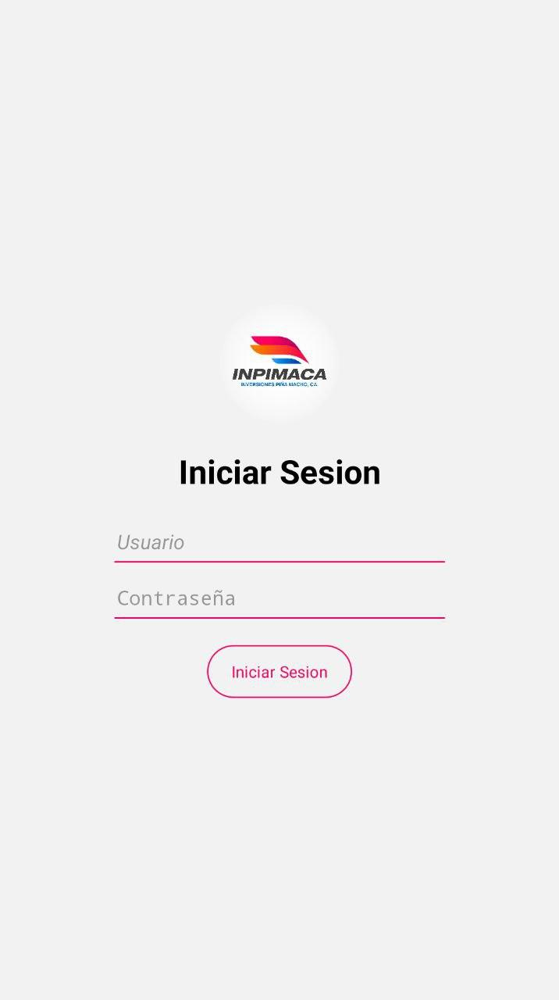
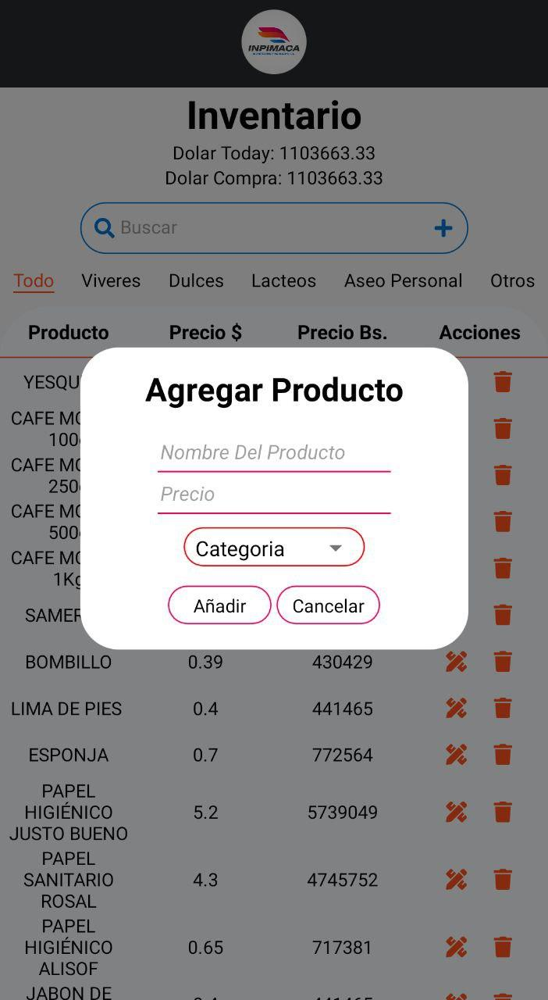

# INPIMACA Mobile App

This is a mobile version for the [INPIMACA Web app](https://github.com/Edjopima/inpimaca-app); is built with React Native and implement the same API than theweb app. [INPIMACA API](https://github.com/Edjopima/inpimaca-api).

## Screenshots

